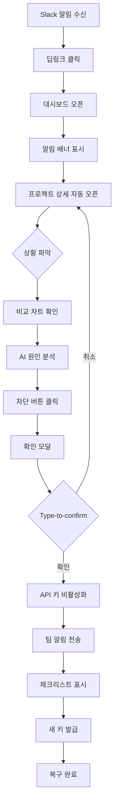

# FinOps for AI - UX Design Specification

_Created on 2025-11-01 by Issac_
_Generated using BMad Method - Create UX Design Workflow v1.0_

---

## Executive Summary

이 문서는 **FinOps for AI 플랫폼**의 UX 디자인 명세서입니다. AI 비용 관리라는 복잡한 도메인을 **통제감과 자신감**이라는 핵심 감정으로 풀어내며, 파워 유저(FinOps 팀, DevOps)와 경영진 모두가 사용 가능한 이중 인터페이스를 제공합니다.

**핵심 디자인 원칙:**
1. **행동 우선**: 정보 나열이 아닌 "다음 할 일"을 명확히 제시
2. **역할별 적응**: 경영진 뷰 ↔ 파워 유저 뷰 즉시 전환
3. **긴급 대응 최적화**: 알림 → 차단까지 17.5분 내 완료
4. **모바일 + 데스크톱**: 모든 플랫폼에서 완벽한 경험

**주요 성과:**
- ✅ Premium Indigo 컬러 테마로 혁신성과 프리미엄 이미지 전달
- ✅ shadcn/ui 기반 모던 미니멀 디자인 (Linear 스타일)
- ✅ Command Center + Minimal Focus 하이브리드 레이아웃
- ✅ WCAG 2.1 AA 접근성 준수
- ✅ 3가지 핵심 여정 완벽 설계

---

## 1. Design System Foundation

### 1.1 Design System Choice

**선택: shadcn/ui + Tailwind CSS**

**이유:**
- ✓ 완전한 커스터마이징 가능 (Premium Indigo 테마 구현)
- ✓ Linear 스타일의 모던 미니멀 디자인
- ✓ 가벼운 번들 크기 (컴포넌트 직접 복사)
- ✓ TypeScript 네이티브 지원
- ✓ Radix UI 기반으로 접근성 보장

**버전:**
- shadcn/ui: latest (2025)
- Tailwind CSS: v3.4+
- React: 18+
- TypeScript: 5+

**보완 라이브러리:**
```
데이터 테이블: @tanstack/react-table v8
차트: recharts v2
아이콘: lucide-react
폼: react-hook-form + zod
날짜: date-fns
```

**제공 컴포넌트 (shadcn/ui):**
- Button, Input, Select, Checkbox, Radio, Switch
- Dialog, AlertDialog, Toast, Alert
- Card, Tabs, Accordion, Collapsible
- Dropdown Menu, Popover, Tooltip
- Badge, Avatar, Separator, Progress
- Form (react-hook-form 통합)

**커스텀 컴포넌트 (7개):**
1. StatCard - 통계 카드
2. AlertBanner - 긴급 알림 배너
3. CostChart - 비용 차트
4. ProjectCard - 프로젝트 카드
5. ConfirmationModal - 확인 모달
6. ViewSwitcher - 역할별 뷰 전환
7. ActionChecklist - 액션 체크리스트

---

## 2. Core User Experience

### 2.1 Defining Experience

**FinOps for AI는 두 가지 핵심 경험을 동등하게 제공합니다:**

#### **경험 1: 실시간 가시성 - "한눈에 모든 것을 이해"**

**목표**: 대시보드 열면 3초 안에 전체 상황 파악

**특징:**
- 정보 계층 완벽 (중요한 것이 눈에 띔)
- 역할별 맞춤 뷰 (경영진 vs 파워 유저)
- 데이터가 많아도 혼란스럽지 않음

**UX 구현:**
- 큰 통계 카드 (핵심 메트릭 강조)
- 색상 코딩 (정상/경고/위험 즉시 구분)
- Progressive Disclosure (필요한 만큼만 표시)

#### **경험 2: 즉시 대응 - "위기를 17분에 해결"**

**목표**: 알림 → 확인 → 차단이 끊김 없이 흐름

**특징:**
- 모바일에서도 완벽한 긴급 조치
- "지금 무엇을 해야 하는가" 명확
- 실수 방지 + 빠른 실행 균형

**UX 구현:**
- 딥링크로 즉시 해당 화면 오픈
- 차단 버튼 항상 visible (스크롤 불필요)
- Type-to-confirm으로 실수 방지
- 자동 커뮤니케이션 (팀 알림)

### 2.2 Core Experience Principles

**1. 속도 (Speed)**
- 대시보드 로딩: <3초 (P95)
- 알림 → 차단: <1분
- 키보드 단축키 지원
- 실시간 업데이트 (WebSocket)

**2. 명확성 (Clarity)**
- 정보 계층 엄격 (1차: 긴급, 2차: 중요, 3차: 참고)
- 한국어 우선 (Phase 1)
- 단순한 언어 (전문 용어 최소화)
- 시각적 구분 (색상, 아이콘, 크기)

**3. 신뢰 (Trust)**
- 데이터 정확성 명시 (업데이트 시간 표시)
- 일관된 패턴
- 에러 투명하게 표시
- 실행 취소 옵션 제공 (가능한 경우)

**4. 통제감 (Control)**
- 모든 자동화는 사용자 설정 가능
- 명확한 확인 단계 (중요 행동)
- 역할별 뷰 전환 자유
- 커스터마이징 가능

---

## 3. Visual Foundation

### 3.1 Color System - Premium Indigo

**선택 이유:**
- AI 시대의 혁신성 상징
- 프리미엄한 브랜드 이미지
- 여전히 깔끔한 미니멀 디자인
- 차별화된 아이덴티티

**컬러 팔레트:**

**Primary (인디고)**
```
Primary:       #6366f1
Primary Dark:  #4338ca
Primary Light: #818cf8
Background:    #0f0a1a (다크 인디고)
```

**Semantic Colors**
```
Success:  #10b981 (녹색) - 정상, 절감, 효율
Warning:  #f59e0b (오렌지) - 주의, 근접
Error:    #ef4444 (빨강) - 위험, 초과, 긴급
Info:     #3b82f6 (파랑) - 정보, 안내
```

**Neutral Scale (회색)**
```
900 (Darkest):  #0f0a1a  - 배경
800:            #1e1b29  - 카드 배경
700:            #312d40  - 테두리
600:            #5b5570  - Disabled
500:            #a5a0b8  - 보조 텍스트
400:            #c5c1d8  - 힌트
100 (Lightest): #ffffff  - 주 텍스트
```

**사용 규칙:**
- Primary: 주요 액션, 브랜드 강조, Active 상태
- Success: 정상 작동, 비용 절감, 목표 달성
- Warning: 임계값 근접, 주의 필요
- Error: 한도 초과, 시스템 오류, 긴급 상황
- Neutral: 배경, 텍스트, 구분선

**다크 모드 전용:**
- Phase 1은 다크 모드만 지원
- 라이트 모드는 Phase 2 고려

### 3.2 Typography

**폰트 패밀리:**
```
Heading & Body:
- Inter (웹폰트)
- 또는 시스템 폰트: -apple-system, BlinkMacSystemFont, 'Segoe UI'
- 한국어: Noto Sans KR, 'Malgun Gothic', sans-serif

Monospace (코드, 메트릭):
- JetBrains Mono
- 또는 'Monaco', 'Courier New', monospace
```

**Type Scale:**
```
Display (Hero):  64px / 4rem   - 경영진 뷰 큰 숫자
H1:              32px / 2rem   - 페이지 제목
H2:              24px / 1.5rem - 섹션 제목
H3:              20px / 1.25rem - 서브섹션
H4:              16px / 1rem   - 카드 제목
Body:            14px / 0.875rem - 본문
Small:           13px / 0.8125rem - 캡션
Tiny:            12px / 0.75rem - 레이블
```

**Font Weights:**
```
Regular: 400 - 본문
Medium:  500 - 강조
Semibold: 600 - 제목
Bold:    700 - Hero, 주요 숫자
```

**Line Heights:**
```
Tight:   1.25 - 제목
Normal:  1.5  - 본문
Relaxed: 1.6  - 긴 텍스트, 모바일
```

### 3.3 Spacing System

**Tailwind 기본 (8px 기반):**
```
xs:  4px   (0.25rem)
sm:  8px   (0.5rem)
md:  12px  (0.75rem)
base: 16px  (1rem)
lg:  24px  (1.5rem)
xl:  32px  (2rem)
2xl: 48px  (3rem)
3xl: 64px  (4rem)
```

**적용 예시:**
- 버튼 패딩: px-4 py-2 (16px × 8px)
- 카드 패딩: p-6 (24px)
- 섹션 간격: mb-8 (32px)
- 페이지 여백: p-8 md:p-12 (32px → 48px)

### 3.4 Layout Grid

**컨테이너:**
```
최대폭: 1600px (중앙 정렬)
여백: 40px (Desktop), 20px (Mobile)
```

**그리드 시스템:**
```
Desktop:  12열 그리드
Tablet:   8열 그리드
Mobile:   4열 그리드

Gap: 24px (lg), 16px (md), 12px (sm)
```

**통계 카드 그리드:**
```
Desktop:  4열 (repeat(4, 1fr))
Tablet:   2열 (repeat(2, 1fr))
Mobile:   1열 (1fr)
```

---

## 4. Design Direction

### 4.1 Chosen Design Approach

**선택: Command Center + Minimal Focus 하이브리드**

**레이아웃 구조:**
```
┌─────────────────────────────────────┐
│ 사이드바 (280px)  │  메인 콘텐츠     │
│                   │                  │
│ ⚡ FinOps AI      │  페이지 헤더     │
│                   │  ━━━━━━━━━━━━━  │
│ 📊 대시보드       │                  │
│ 🔔 알림           │  [경영진 뷰]     │
│ 📁 프로젝트       │  큰 Hero 숫자    │
│ 👥 팀 관리        │                  │
│ ⚙️ 설정           │  [파워 유저 뷰]  │
│                   │  상세 통계 그리드│
│                   │  차트 + 테이블   │
└─────────────────────────────────────┘
```

**파워 유저 뷰 (기본):**
- 사이드바 네비게이션 (항상 표시)
- 4열 통계 카드 그리드
- 상세 차트 + 테이블
- 모든 메트릭 접근 가능

**경영진 뷰 (전환 가능):**
- 사이드바 유지
- 1개 큰 Hero 숫자 (오늘 총 비용)
- 3문장 요약
- 핵심만 표시

**모바일 적응:**
- 사이드바 → 바텀 네비게이션
- 통계 그리드 → 1열 스택
- 테이블 → 카드 뷰

**선택 이유:**
1. 파워 유저: 많은 정보 + 빠른 네비
2. 경영진: 뷰 전환으로 단순화
3. 긴급 상황: 알림 배너 + 빠른 액션
4. 모바일: 완벽 최적화

**Interactive Mockups:**
- Design Direction Showcase: [ux-design-directions.html](./ux-design-directions.html)

### 4.2 Key Layout Decisions

**네비게이션:**
- Pattern: 사이드바 (Desktop), 바텀 네비 (Mobile)
- Width: 280px (고정)
- Position: 좌측 고정
- Collapse: Tablet에서 아이콘만 또는 숨김

**콘텐츠 구조:**
- Single Column: 기본
- Multi-Column: 차트 + 사이드 패널 (선택적)
- Cards: 주요 콘텐츠 단위
- Lists: 프로젝트, 알림 목록

**정보 계층:**
- Level 1 (긴급): 알림 배너 (화면 상단 고정)
- Level 2 (주요): 큰 통계 카드
- Level 3 (상세): 차트, 테이블
- Level 4 (보조): 메타 정보, 타임스탬프

**시각적 밀도:**
- Spacious: 경영진 뷰 (여백 많음)
- Balanced: 파워 유저 뷰 (중간)
- Dense: 테이블 상세 뷰 (정보 밀집)

**인터랙션 패턴:**
- Primary: 버튼 클릭
- Secondary: 카드 클릭 (드릴다운)
- Tertiary: 호버 툴팁
- Advanced: 키보드 단축키

---

## 5. User Journey Flows

### 5.1 Journey 1: 비용 급증 감지 및 즉시 대응 🚨

**사용자**: FinOps 관리자 (이지훈)
**플랫폼**: 모바일/데스크톱 모두
**목표**: AI 비용 폭주를 조기에 발견하고 즉시 중단
**소요 시간**: 17.5분

**플로우:**

```
1. 알림 수신 (Slack)
   ├─ 제목: "🚨 마케팅팀 일일 한도 초과"
   ├─ 본문: "$500 → $742 (148%)"
   ├─ 컨텍스트: "chatbot-experiment"
   └─ CTA: "즉시 확인" (딥링크)
        ↓
2. 상황 파악 (2분)
   ├─ 웹 대시보드 자동 오픈 (딥링크)
   ├─ 알림 배너 상단 고정 표시
   ├─ 프로젝트 상세 자동 오픈
   ├─ 비교 차트 (어제 vs 오늘)
   ├─ AI 원인 분석 표시
   └─ 행동 옵션 3가지 제시
        ↓
3. 즉시 차단 (30초)
   ├─ "즉시 차단" 버튼 클릭
   ├─ 확인 모달 (Type-to-confirm)
   ├─ 영향 범위 명시
   ├─ "차단" 타이핑 후 확인
   └─ API 키 비활성화 완료
        ↓
4. 팀 커뮤니케이션 (5분)
   ├─ 자동 생성된 Slack 메시지 프리뷰
   ├─ 편집 가능
   ├─ @멘션 자동 추가
   └─ 팀에 전송
        ↓
5. 복구 및 모니터링 (10분)
   ├─ 체크리스트 표시
   ├─ 타임라인 추적
   ├─ 새 API 키 발급
   └─ 모니터링 재개
```

**핵심 터치포인트:**
- Slack 알림 → 딥링크
- 알림 배너 (고정, dismissible 안함)
- "차단" 버튼 (항상 visible)
- Type-to-confirm 모달
- 자동 팀 커뮤니케이션
- 체크리스트 진행 추적

**UX 설계 결정:**
- ✓ 딥링크: 홈 → 프로젝트 탐색 불필요
- ✓ 정보 계층: 긴급 → 비교 → 원인 → 행동
- ✓ 모바일: 차단 버튼 하단 고정
- ✓ 안전장치: Type-to-confirm
- ✓ 자동화: 메시지 초안 생성

**Mermaid 다이어그램:**


### 5.2 Journey 2: 주간 리포트 확인 및 인사이트 파악 📊

**사용자**: FinOps 관리자 + 경영진
**플랫폼**: 데스크톱 (월요일 아침 루틴)
**목표**: 주간 비용 현황 파악 및 개선 포인트 식별
**소요 시간**: 5-10분

**플로우:**

```
1. 이메일 리포트 수신 (월요일 오전 9시)
   ├─ 제목: "주간 AI 비용 리포트 - $284,920"
   ├─ 요약: 총 비용, 전주 대비, 예산 대비
   ├─ 하이라이트: Top 3 / Bottom 3
   ├─ 최적화 권고 2건
   └─ CTA: "전체 리포트 보기"
        ↓
2. 대시보드 주간 뷰 (역할별)

   [경영진이 먼저 확인하는 경우]
   ├─ 경영진 뷰 자동 선택
   ├─ Hero 숫자: $284,920
   ├─ 3문장 요약
   ├─ 핵심 인사이트만
   └─ "상세 보기" → 파워 유저 뷰로 전환 가능

   [FinOps 팀이 확인하는 경우]
   ├─ 파워 유저 뷰 (기본)
   ├─ 통계 그리드 6개
   ├─ Top/Bottom 프로젝트 테이블
   ├─ 비용 추이 차트 (7일)
   ├─ 최적화 권고 카드
   └─ 필터/드릴다운 옵션
        ↓
3. 인사이트 탐색
   ├─ Top 3 프로젝트 확인
   ├─ Bottom 3 개선 필요 식별
   ├─ 최적화 권고 검토
   └─ 필요 시 프로젝트 드릴다운
        ↓
4. 액션 결정
   ├─ 개선 필요 프로젝트 팀에 알림
   ├─ 최적화 권고 태스크 생성
   └─ 다음 주 목표 설정
```

**핵심 터치포인트:**
- 이메일 리포트 (요약 포함)
- ViewSwitcher (경영진 ↔ 파워 유저)
- Hero 숫자 (경영진 뷰)
- 통계 그리드 (파워 유저 뷰)
- Top/Bottom 테이블
- 최적화 권고 카드

**UX 설계 결정:**
- ✓ 역할별 자동 감지 (또는 수동 전환)
- ✓ 경영진: 3문장 요약 + 큰 숫자
- ✓ 파워 유저: 드릴다운 + 상세 테이블
- ✓ 한 번의 클릭으로 뷰 전환
- ✓ 필터 저장 가능

### 5.3 Journey 3: 프로젝트별 비용 드릴다운 🔍

**사용자**: FinOps 관리자, ML 엔지니어
**플랫폼**: 데스크톱 주로
**목표**: 특정 프로젝트의 상세 비용 분석
**소요 시간**: 3-5분

**플로우:**

```
1. 대시보드에서 프로젝트 선택
   ├─ 프로젝트 카드 클릭
   └─ 또는 검색 → 선택
        ↓
2. 프로젝트 상세 화면
   ├─ 헤더
   │   ├─ 프로젝트명 + 팀
   │   ├─ 현재 상태 배지
   │   └─ 빠른 액션 (API 키 관리, 임계값)
   ├─ 탭 네비게이션
   │   ├─ [개요] - 전체 메트릭
   │   ├─ [비용 분석] - 시간별/일별 추이
   │   ├─ [효율성] - 비용 대비 성과
   │   ├─ [알림] - 히스토리
   │   └─ [설정] - 임계값, API 키
   └─ 브레드크럼: 홈 > 프로젝트 > {name}
        ↓
3. 탭별 상세 정보
   [개요 탭]
   ├─ 통계 카드 4개
   ├─ 비용 추이 차트
   └─ 최근 알림

   [비용 분석 탭]
   ├─ 시간별 비용 그래프
   ├─ 일별/주별/월별 전환
   └─ 비교 (전월, 예산)

   [효율성 탭]
   ├─ 비용 대비 성과 메트릭
   ├─ API 호출당 비용
   └─ 최적화 제안
        ↓
4. 필요 시 액션
   ├─ 임계값 조정
   ├─ API 키 재생성
   └─ 팀에 리포트 공유
```

**핵심 터치포인트:**
- 프로젝트 카드 (클릭 가능)
- 탭 네비게이션 (5개 탭)
- 통계 카드 + 차트
- 빠른 액션 버튼
- 브레드크럼 (컨텍스트 유지)

**UX 설계 결정:**
- ✓ 탭으로 정보 구조화
- ✓ 브레드크럼으로 위치 표시
- ✓ 빠른 액션 헤더에 고정
- ✓ 딥링크 지원 (/projects/:id)
- ✓ 모든 탭에서 헤더 정보 유지

---

## 6. Component Library

### 6.1 Component Strategy

**3-Tier 구조:**

**Tier 1: shadcn/ui 기본 컴포넌트 (20+개)**
- Button, Input, Select, Checkbox, Radio, Switch
- Dialog, AlertDialog, Toast, Alert
- Card, Tabs, Accordion
- Dropdown Menu, Popover, Tooltip
- Badge, Avatar, Separator, Progress
- Form

**Tier 2: 보완 라이브러리**
- Tanstack Table: 데이터 테이블
- Recharts: 차트/시각화
- Radix UI: 접근성 (shadcn/ui 내부)
- Lucide React: 아이콘

**Tier 3: 커스텀 FinOps 컴포넌트 (7개)**

### 6.2 Custom Components

#### **1. StatCard - 통계 카드**

```typescript
<StatCard
  label="오늘 총 비용"
  value="$47,234"
  change="+12%"
  trend="up" // up, down, neutral
  variant="primary" // primary, success, warning, error
  size="lg" // sm, md, lg
  onClick={handleDrilldown}
/>
```

**Features:**
- 라벨, 값, 변화율, 트렌드 표시
- 4가지 variant (색상 코딩)
- 3가지 크기
- 클릭 가능 (드릴다운)
- 호버 시 lift up 효과

**States:**
- Default, Hover, Clickable
- Loading (skeleton)

**Responsive:**
- Desktop: 4열 그리드
- Tablet: 2열
- Mobile: 1열 스택

#### **2. AlertBanner - 긴급 알림 배너**

```typescript
<AlertBanner
  type="critical" // info, warning, critical
  title="마케팅팀 일일 한도 초과"
  message="현재 $742 (148%)"
  actions={[
    { label: "즉시 차단", variant: "danger", onClick: handleBlock },
    { label: "상세 보기", variant: "ghost", onClick: handleDetails }
  ]}
  dismissible={false}
/>
```

**Features:**
- 3가지 타입 (색상 구분)
- 제목 + 메시지
- 액션 버튼 배열
- Dismissible 옵션
- 아이콘 자동

**Position:**
- 페이지 상단 고정 (sticky)
- z-index 높음 (다른 콘텐츠 위)

**Animation:**
- 슬라이드 다운
- 부드러운 나타남

#### **3. CostChart - 비용 차트**

```typescript
<CostChart
  data={costData}
  type="trend" // trend, comparison, distribution
  timeRange="7d" // 1d, 7d, 30d, custom
  compareWith="average" // previous, budget, average
  highlight={["chatbot-experiment"]}
  onDataPointClick={handleDrilldown}
/>
```

**Features:**
- 3가지 차트 타입
- 시간 범위 선택
- 비교 라인 표시
- 특정 항목 하이라이트
- 클릭 드릴다운

**Recharts Integration:**
- LineChart (추이)
- BarChart (비교)
- AreaChart (누적)
- 커스텀 툴팁

**Responsive:**
- Desktop: 16:9 비율
- Tablet: 4:3
- Mobile: 세로 강조 (3:4)

#### **4. ProjectCard - 프로젝트 카드**

```typescript
<ProjectCard
  name="Chatbot Experiment"
  team="마케팅팀"
  cost="$742"
  status="critical" // normal, warning, critical
  trend={{
    current: "$742",
    previous: "$50",
    change: "+1384%"
  }}
  actions={[
    { icon: "block", label: "차단", onClick: handleBlock },
    { icon: "settings", label: "설정", onClick: handleSettings }
  ]}
  onClick={handleCardClick}
/>
```

**Features:**
- 프로젝트 정보 표시
- 상태별 테두리 색상
- 트렌드 표시
- 빠른 액션 버튼
- 클릭 가능

**States:**
- Normal: 회색 테두리
- Warning: 노란색 테두리
- Critical: 빨간색 테두리 + 애니메이션 (pulse)

#### **5. ConfirmationModal - 확인 모달**

```typescript
<ConfirmationModal
  title="API 키 차단 확인"
  severity="critical" // info, warning, critical
  message="이 키를 사용하는 모든 앱이 중단됩니다"
  impactDetails={{
    project: "chatbot-experiment",
    team: "마케팅팀",
    activeRequests: "~1,200/분"
  }}
  confirmationType="type-to-confirm" // click, type-to-confirm
  confirmText="차단"
  onConfirm={handleConfirm}
  onCancel={handleCancel}
/>
```

**Features:**
- 3가지 severity 레벨
- 영향 범위 표시
- Type-to-confirm (critical용)
- 명확한 액션 버튼

**Type-to-confirm:**
- 입력 필드 표시
- 정확히 일치해야 활성화
- 실수 방지

#### **6. ViewSwitcher - 역할별 뷰 전환**

```typescript
<ViewSwitcher
  currentView="power-user" // executive, power-user
  onChange={handleViewChange}
/>
```

**Features:**
- 2가지 뷰 (경영진, 파워 유저)
- 토글 UI
- 현재 뷰 표시
- 애니메이션 전환

**Position:**
- 페이지 헤더 우측
- 항상 visible

**Animation:**
- Fade + Scale
- 부드러운 전환 (0.3s)

#### **7. ActionChecklist - 액션 체크리스트**

```typescript
<ActionChecklist
  title="복구 프로세스"
  items={[
    { id: 1, label: "API 키 차단", status: "completed" },
    { id: 2, label: "팀 확인 대기 중", status: "in-progress" },
    { id: 3, label: "버그 수정", status: "pending" },
    { id: 4, label: "새 API 키 발급", status: "pending" }
  ]}
  onItemClick={handleItemAction}
/>
```

**Features:**
- 체크리스트 형식
- 4가지 상태 (completed, in-progress, pending, failed)
- 클릭 가능 (액션 실행)
- 타임스탬프 표시 (옵션)

**Status Icons:**
- Completed: ✅ 녹색
- In Progress: ⏳ 노란색 + 애니메이션
- Pending: ⬜ 회색
- Failed: ❌ 빨간색

---

## 7. UX Pattern Decisions

### 7.1 Consistency Rules

**이 섹션은 전체 앱에서 일관성을 보장하는 규칙입니다.**

#### **버튼 계층**

```
Primary:     배경 #6366f1, 페이지당 1개
Secondary:   투명, 테두리 #6366f1, 페이지당 2-3개
Ghost:       투명, 테두리 없음, 덜 중요
Destructive: 배경 #ef4444, 확인 필수
```

**규칙:**
- 한 화면에 Primary는 1개만
- Destructive는 항상 확인 단계
- 버튼 텍스트는 동사로 시작
- 로딩 중에는 비활성화 + 스피너

#### **피드백 패턴**

```
Success:  Toast (우측 상단, 3초 자동)
Error:    Alert Banner (상단, 수동 dismiss)
Warning:  Inline Alert (컨텍스트 내)
Info:     Tooltip (호버 시)
Loading:  Skeleton / Spinner
```

#### **폼 패턴**

```
Label:       위 (top)
Required:    빨간 별표 *
Validation:  onBlur + onSubmit
Error:       입력 필드 아래, 빨간 텍스트
Help Text:   라벨 아래 또는 입력 아래, 회색
```

#### **모달 패턴**

```
Size:     sm (400px), md (600px), lg (800px), full (mobile)
Dismiss:  ESC, 외부 클릭, X 버튼
          Critical: 외부 클릭 차단
Focus:    첫 입력 또는 Primary 버튼
Stacking: 최대 2개
```

#### **네비게이션 패턴**

```
Active:      배경 rgba(#6366f1, 0.1), 텍스트 #6366f1
Breadcrumb:  3단계 이상, 마지막 굵게
Back:        브라우저 뒤로 가기 존중
Deep Link:   모든 주요 페이지 지원
```

#### **Empty State 패턴**

```
First Use:    아이콘 + 안내 + CTA
No Results:   메시지 + 제안
Cleared:      긍정 메시지 + Undo 옵션
```

#### **확인 패턴**

```
Delete:          Type-to-confirm
Leave Unsaved:   확인 모달
Irreversible:    2단계 확인 + 경고
```

#### **알림 패턴**

```
Placement:  Toast (우측 상단), Banner (상단)
Duration:   Success 3초, Warning/Error 수동
Stacking:   최대 3개
Priority:   Critical > Important > Info
```

#### **검색 패턴**

```
Trigger:    실시간 (300ms debounce) 또는 Enter
Results:    드롭다운 또는 전체 페이지
Filters:    드롭다운, 즉시 적용
No Results: 제안 제공
```

#### **날짜/시간 패턴**

```
Format:     상대 시간 (7일 이내), 절대 날짜 (이후)
Timezone:   사용자 로컬 (KST 명시)
Picker:     달력 UI + 빠른 선택
```

---

## 8. Responsive Design & Accessibility

### 8.1 Responsive Strategy

**브레이크포인트:**
```
Mobile:   0-767px    (1열)
Tablet:   768-1023px (2열)
Desktop:  1024-1439px (3-4열)
Wide:     1440px+    (최대 1600px)
```

**디바이스별 적응:**

**Mobile (최우선 최적화):**
```
레이아웃:
- 사이드바 → 바텀 네비게이션
- 통계 그리드 → 1열 스택
- 테이블 → 카드 뷰
- 모달 → 전체 화면

터치:
- 최소 타겟: 44px × 44px
- 버튼 간격: 8px
- 스와이프 제스처 지원

긴급 대응:
- 차단 버튼 하단 고정
- 한 손 조작 가능
- Bottom Sheet 모달
```

**Tablet:**
```
레이아웃:
- 사이드바 접기 가능
- 2열 그리드
- 일부 컬럼 숨김

네비게이션:
- 세로: 바텀 네비
- 가로: 사이드바

터치 + 마우스:
- 터치 타겟 유지
- 호버 효과 지원
```

**Desktop:**
```
레이아웃:
- 사이드바 고정 (280px)
- 4열 그리드
- 모든 컬럼 표시

네비게이션:
- 사이드바 + 브레드크럼
- 키보드 단축키

마우스:
- 호버 효과
- 툴팁
- 컨텍스트 메뉴
```

**Wide:**
```
레이아웃:
- 최대폭 1600px (중앙 정렬)
- 5-6열 그리드 가능
- Split View

추가:
- Picture-in-Picture
- 멀티 대시보드
```

**반응형 컴포넌트 예시:**

```typescript
// StatCard 그리드
<div className="grid grid-cols-1 md:grid-cols-2 lg:grid-cols-4 gap-4">
  <StatCard ... />
</div>

// 사이드바
<aside className="hidden lg:block w-[280px]">
  <Sidebar />
</aside>

// 모바일 바텀 네비
<nav className="lg:hidden fixed bottom-0 ...">
  <BottomNav />
</nav>
```

### 8.2 Accessibility Strategy

**WCAG 2.1 AA 준수 목표**

**색상 대비:**
```
일반 텍스트 (14-18px): 4.5:1 최소
큰 텍스트 (18px+):     3:1 최소
UI 컴포넌트:           3:1 최소

검증 완료:
✅ #ffffff / #0f0a1a → 17.2:1 (AAA)
✅ #6366f1 / #0f0a1a → 8.1:1 (AAA)
✅ #a5a0b8 / #1e1b29 → 5.2:1 (AA)
```

**색맹 대응:**
```
정보를 색상만으로 전달하지 않음:
- Success: 녹색 + ✅ 아이콘
- Error: 빨간색 + ⚠️ 아이콘
- Warning: 노란색 + ⚠️ 아이콘
```

**키보드 네비게이션:**
```
Tab / Shift+Tab: 요소 이동
Enter:           Primary 버튼
Space:           체크박스 토글
Escape:          모달 닫기
Arrow Keys:      드롭다운 내 이동

포커스 인디케이터:
- 2px solid #6366f1
- 오프셋 2px
- 모든 인터랙티브 요소

Skip Links:
- "주요 콘텐츠로 건너뛰기"
- Tab 첫 포커스 시 표시
```

**스크린 리더:**
```html
<!-- ARIA 레이블 -->
<button aria-label="마케팅팀 API 키 차단">
  차단
</button>

<!-- Live Regions -->
<div role="alert" aria-live="assertive">
  🚨 비용 임계값 초과
</div>

<!-- Hidden Content -->
<span className="sr-only">
  현재 페이지: 대시보드
</span>
```

**폼 접근성:**
```html
<!-- 레이블 연결 -->
<label htmlFor="threshold">일일 한도</label>
<input id="threshold" aria-required="true" />

<!-- 에러 연결 -->
<input
  aria-invalid="true"
  aria-describedby="threshold-error"
/>
<span id="threshold-error" role="alert">
  ⚠️ 형식이 올바르지 않습니다
</span>
```

**터치 타겟:**
```
최소 크기: 44px × 44px (WCAG 2.1 AA)
간격: 최소 8px
모바일 긴급 버튼: 56px 높이
```

**텍스트 크기 조정:**
```
기본: 16px (1rem)
최대 확대: 200% 지원
단위: rem/em (px 금지)
line-height: 최소 1.5
```

**모션 존중:**
```css
@media (prefers-reduced-motion: reduce) {
  * {
    animation: none !important;
    transition: none !important;
  }
}
```

**접근성 테스트:**
```
자동화:
- Lighthouse (CI/CD)
- axe DevTools
- jest-axe

수동:
- 키보드만으로 테스트
- 스크린 리더 (NVDA, JAWS, VoiceOver)
- 색맹 시뮬레이터

주기:
- 모든 PR
- 주요 기능 출시 전 사용자 테스트
```

---

## 9. Implementation Guidance

### 9.1 Development Roadmap

**Phase 1: 기반 구축 (Week 1-2)**
```
✓ shadcn/ui 설치 및 테마 커스터마이징
✓ Premium Indigo 컬러 시스템 적용
✓ 타이포그래피 설정
✓ 기본 레이아웃 (AppShell, Sidebar)
✓ 라우팅 설정
```

**Phase 2: 핵심 컴포넌트 (Week 3-4)**
```
✓ 7개 커스텀 컴포넌트 구축
  - StatCard
  - AlertBanner
  - CostChart (Recharts 통합)
  - ProjectCard
  - ConfirmationModal
  - ViewSwitcher
  - ActionChecklist
✓ Tanstack Table 설정
✓ 스토리북 문서화
```

**Phase 3: 주요 화면 (Week 5-6)**
```
✓ 대시보드 홈 (파워 유저 + 경영진 뷰)
✓ 프로젝트 목록
✓ 프로젝트 상세 (5개 탭)
✓ 알림 센터
✓ 설정
```

**Phase 4: 반응형 & 접근성 (Week 7)**
```
✓ 모바일 최적화
  - 바텀 네비게이션
  - 카드 뷰 전환
  - 터치 타겟 확대
✓ 접근성 검증
  - 키보드 네비게이션
  - 스크린 리더 테스트
  - 색상 대비 검증
✓ lighthouse/axe 통과
```

**Phase 5: 폴리싱 (Week 8)**
```
✓ 애니메이션 추가
✓ 로딩 상태 완성
✓ 에러 처리 강화
✓ 성능 최적화
✓ 사용자 테스트 피드백 반영
```

### 9.2 Tech Stack

```typescript
// 프론트엔드
- React 18+
- TypeScript 5+
- Next.js 16+ (App Router)
- Tailwind CSS 3.4+
- shadcn/ui (latest)

// 상태 관리
- Zustand 또는 Redux Toolkit

// 데이터 페칭
- TanStack Query (React Query)

// 폼
- react-hook-form + zod

// 차트
- recharts v2

// 테이블
- @tanstack/react-table v8

// 아이콘
- lucide-react

// 날짜
- date-fns

// 테스팅
- Jest + React Testing Library
- Playwright (E2E)
- jest-axe (접근성)

// 린팅
- ESLint + Prettier
- eslint-plugin-jsx-a11y
```

### 9.3 File Structure

```
src/
├─ components/
│  ├─ ui/              # shadcn/ui 컴포넌트
│  │  ├─ button.tsx
│  │  ├─ card.tsx
│  │  └─ ...
│  ├─ custom/          # 커스텀 컴포넌트
│  │  ├─ stat-card.tsx
│  │  ├─ alert-banner.tsx
│  │  ├─ cost-chart.tsx
│  │  └─ ...
│  └─ layout/          # 레이아웃 컴포넌트
│     ├─ app-shell.tsx
│     ├─ sidebar.tsx
│     └─ bottom-nav.tsx
├─ app/                # Next.js App Router
│  ├─ dashboard/
│  ├─ projects/
│  ├─ alerts/
│  └─ settings/
├─ lib/                # 유틸리티
│  ├─ utils.ts
│  ├─ cn.ts           # Tailwind 클래스 병합
│  └─ api.ts
├─ hooks/              # 커스텀 훅
├─ stores/             # 상태 관리
├─ types/              # TypeScript 타입
└─ styles/
   └─ globals.css      # Tailwind + 테마
```

### 9.4 Design Tokens

```css
/* globals.css */
@tailwind base;
@tailwind components;
@tailwind utilities;

@layer base {
  :root {
    /* Premium Indigo Theme */
    --background: 240 67% 6%;        /* #0f0a1a */
    --foreground: 0 0% 100%;         /* #ffffff */

    --primary: 239 84% 67%;          /* #6366f1 */
    --primary-foreground: 0 0% 100%;

    --secondary: 240 21% 15%;        /* #1e1b29 */
    --secondary-foreground: 0 0% 100%;

    --success: 158 64% 52%;          /* #10b981 */
    --warning: 38 92% 50%;           /* #f59e0b */
    --error: 4 90% 58%;              /* #ef4444 */

    --muted: 240 21% 15%;            /* #1e1b29 */
    --muted-foreground: 240 15% 65%; /* #a5a0b8 */

    --border: 240 23% 22%;           /* #312d40 */
    --input: 240 23% 22%;
    --ring: 239 84% 67%;

    --radius: 0.5rem;
  }
}
```

### 9.5 Performance Targets

```
로딩 시간:
- 대시보드 초기 로딩: <3초 (P95)
- 페이지 전환: <500ms
- API 응답: <500ms (P95)

번들 크기:
- First Load JS: <200KB
- 페이지별 청크: <100KB

Core Web Vitals:
- LCP: <2.5초
- FID: <100ms
- CLS: <0.1

접근성:
- Lighthouse Accessibility: 95+
- axe violations: 0
```

### 9.6 Browser Support

```
Desktop:
✓ Chrome 90+ (Chromium)
✓ Firefox 88+
✓ Safari 14+
✓ Edge 90+

Mobile:
✓ iOS Safari 14+
✓ Chrome Android 90+
✓ Samsung Internet 14+

Not Supported:
✗ IE 11
✗ Opera Mini
```

---

## 10. Interactive Deliverables

이 UX 디자인은 시각적 탐색을 통해 만들어졌습니다.

### 10.1 Color Theme Visualizer

**파일**: [ux-color-themes.html](./ux-color-themes.html)

**내용:**
- 4가지 컬러 테마 옵션 (Trust Blue, Growth Green, Premium Indigo, Modern Slate)
- 각 테마의 전체 팔레트 (Primary, Semantic, Neutral)
- 실제 UI 컴포넌트 예시 (버튼, 알림, 통계 카드)
- 테마별 감정 및 적합한 조직 유형
- Side-by-side 비교

**선택**: Premium Indigo

### 10.2 Design Direction Mockups

**파일**: [ux-design-directions.html](./ux-design-directions.html)

**내용:**
- 6가지 완전히 다른 디자인 접근 방식
  1. Command Center - 통제실 (사이드바 + 정보 밀집)
  2. Minimal Focus - 미니멀 집중 (Linear 스타일)
  3. Data Dense Pro - 데이터 밀집형 (컴팩트)
  4. Action First - 행동 우선 (CTA 강조)
  5. Split View - 분할 뷰 (개요 + 상세)
  6. Mobile First - 모바일 우선 (바텀 네비)
- 각 방향의 전체 화면 목업
- 디자인 철학 및 장단점
- 키보드 네비게이션 (← → 화살표)

**선택**: Command Center + Minimal Focus 하이브리드

---

## 11. Next Steps & Follow-Up

### 11.1 Recommended Next Actions

**즉시 실행:**
1. ✅ UX 디자인 명세서 승인
2. ✅ 기술 아키텍처 워크플로우 실행 (`/bmad:bmm:workflows:architecture`)
3. ✅ shadcn/ui + Tailwind 프로젝트 세팅
4. ✅ Premium Indigo 테마 구현

**1-2주 내:**
1. 7개 커스텀 컴포넌트 개발 시작
2. Storybook 설정 (컴포넌트 문서화)
3. 접근성 자동화 테스트 설정 (jest-axe)
4. 첫 화면 프로토타입 (대시보드 홈)

**2-4주 내:**
1. 주요 화면 구현 (대시보드, 프로젝트, 알림)
2. 반응형 최적화 (모바일, 태블릿)
3. 접근성 수동 테스트 (키보드, 스크린 리더)
4. 내부 사용자 테스트

### 11.2 Optional Enhancements

**추가 고려 사항 (Phase 2+):**
- 다크 모드 토글 (현재는 다크 전용)
- 라이트 모드 테마
- 커스텀 대시보드 빌더
- 고급 필터 및 저장
- 키보드 단축키 치트시트
- 애니메이션 강화

### 11.3 Validation Checklist

**출시 전 확인 사항:**

**기능 완성도:**
- [ ] 모든 핵심 화면 구현 완료
- [ ] 3가지 사용자 여정 동작 확인
- [ ] 에러 상태 모두 처리
- [ ] 로딩 상태 모두 표시
- [ ] 빈 상태 모두 디자인

**반응형:**
- [ ] Mobile (320px-767px) 테스트
- [ ] Tablet (768px-1023px) 테스트
- [ ] Desktop (1024px+) 테스트
- [ ] 터치 타겟 최소 44px 확인

**접근성:**
- [ ] Lighthouse Accessibility 95+ 점수
- [ ] axe DevTools 0 violations
- [ ] 키보드만으로 모든 기능 접근 가능
- [ ] 스크린 리더 테스트 완료
- [ ] 색상 대비 WCAG AA 통과
- [ ] 포커스 인디케이터 모든 요소

**성능:**
- [ ] Lighthouse Performance 90+
- [ ] 대시보드 로딩 <3초
- [ ] First Load JS <200KB
- [ ] Core Web Vitals 통과

**브라우저:**
- [ ] Chrome (최신)
- [ ] Firefox (최신)
- [ ] Safari (최신)
- [ ] Edge (최신)
- [ ] Mobile Safari (iOS 14+)
- [ ] Chrome Android (최신)

**UX 검증:**
- [ ] 파워 유저 테스트 (3명)
- [ ] 경영진 테스트 (2명)
- [ ] 모바일 긴급 대응 테스트
- [ ] 뷰 전환 동작 확인
- [ ] 에러 복구 시나리오 테스트

---

## 12. Version History

| Date | Version | Changes | Author |
|------|---------|---------|--------|
| 2025-11-01 | 1.0 | Initial UX Design Specification | Issac |

---

## Appendix

### A. Related Documents

- **Product Requirements**: [PRD.md](./PRD.md)
- **Product Brief**: [product-brief-FinOps-for-AI-platform-2025-10-31.md](./product-brief-FinOps-for-AI-platform-2025-10-31.md)
- **Brainstorming**: [bmm-brainstorming-session-2025-10-31.md](./bmm-brainstorming-session-2025-10-31.md)
- **Epic Breakdown**: [epics.md](./epics.md)

### B. Design Resources

**Interactive Deliverables:**
1. **Color Theme Visualizer**: [ux-color-themes.html](./ux-color-themes.html)
   - 4가지 테마 옵션 탐색
   - 실제 UI 컴포넌트 미리보기
   - 선택: Premium Indigo

2. **Design Direction Mockups**: [ux-design-directions.html](./ux-design-directions.html)
   - 6가지 디자인 접근 방식
   - 전체 화면 인터랙티브 목업
   - 선택: Command Center + Minimal Focus 하이브리드

**Design Tokens:**
- Tailwind Config
- CSS Variables
- 컬러 팔레트 (HEX, RGB)
- 타이포그래피 스케일
- 스페이싱 시스템

**Component Library:**
- shadcn/ui 기본 컴포넌트
- 7개 커스텀 컴포넌트 명세
- Tanstack Table 설정
- Recharts 커스터마이징

### C. Inspiration & References

**UX 패턴 출처:**
- Datadog: 실시간 모니터링 + 알림 통합
- Linear: 미니멀 디자인 + 행동 중심
- CFO 대시보드: 명확성 + 경영진 친화적

**디자인 시스템:**
- shadcn/ui: 기본 컴포넌트 + 접근성
- Tailwind CSS: 유틸리티 우선 스타일
- Radix UI: 접근성 primitives

**접근성 가이드:**
- WCAG 2.1 AA
- Apple Human Interface Guidelines
- Material Design Accessibility

---

_이 UX 디자인 명세서는 협업적 디자인 탐색을 통해 만들어졌으며, 모든 결정은 사용자 입력과 근거를 바탕으로 문서화되었습니다._

_**다음 단계**: 기술 아키텍처 워크플로우를 실행하여 이 UX를 실제로 구현할 시스템 설계를 시작하세요._

🎨 **UX Design Specification Complete!**
